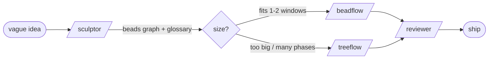

# Router

You don't remember every skill, so ask. A **flow** is a path through the skills. Most work runs along one **main flow**; a few skills stand alone.

## The main flow: idea → ship

1. **`/sculptor`** — turn a vague idea into an implementation-ready **spec + plan + beads graph**. Runs a structured interview (design tree, frontier, rounds, recommended answers) and leaves a paper trail (a domain **glossary** and hard-to-reverse decisions), then exports `.beads/beads-graph.jsonl` for the executors. Start here for any non-trivial build. Writes only markdown, never code.

2. **Execute the graph.** Pick the executor by size — both import sculptor's graph and its glossary:
   - **`/beadflow`** — you are the single executor, working the graph **bead by bead** yourself (sub-agents only for small `[parallel]` groups). Low overhead. For projects that fit in one or two context windows (~5-15 tasks).
   - **`/treeflow`** — **pure orchestrator**: you never touch code, you dispatch the graph to named background **workers** across parallel waves, keeping the orchestrator lean. For work too big for one window, 15-50+ tasks, or repeating-domain phases where worker reuse pays off.

   A beadflow session can be promoted to treeflow when context fills before you're halfway. Full tradeoffs and the decision flowchart: [beadflow-vs-treeflow.md](../ref/beadflow-vs-treeflow.md).

3. **`/reviewer`** — verify: tech-stack checklists and a structured report. Run it adversarially after implementation — assume the implementation is wrong until proven otherwise.

## Standalone

- **`/session-viewer`** — parse and inspect Claude Code session JSONL (view, analyze, or debug a session). Off every flow; reach for it when the session itself is the subject.

## Deprecated

- **stateflow** — an earlier orchestration variant (the `awty` workflow engine on top of `tf.py`). Superseded by **`/treeflow`**. Don't start new work with it.

## Invocation model

- **Model-invoked** — the agent can auto-reach these, and you can also type them: `sculptor`, `treeflow`, `beadflow`, `reviewer`, `session-viewer`.
- **User-invoked** — only you type it: `router` (this skill).

Keep this map honest: when a skill is added, removed, renamed, or deprecated, update this file **and** the README in the same change. A router that lies is worse than none.
